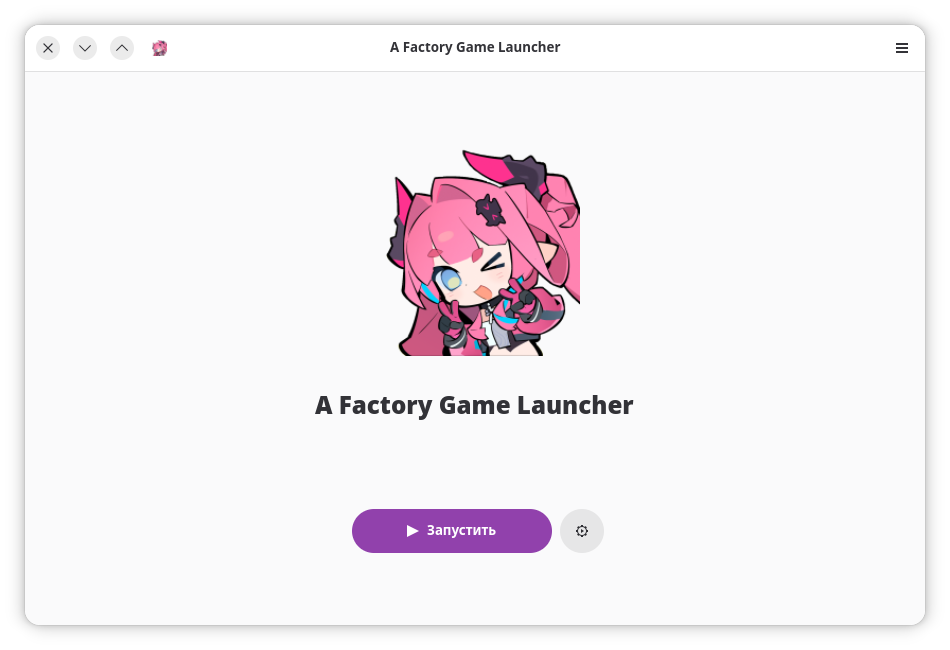
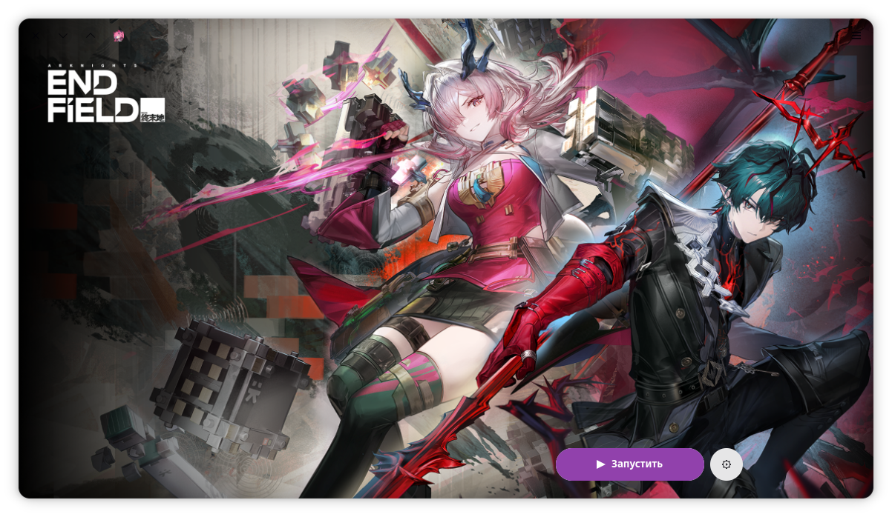
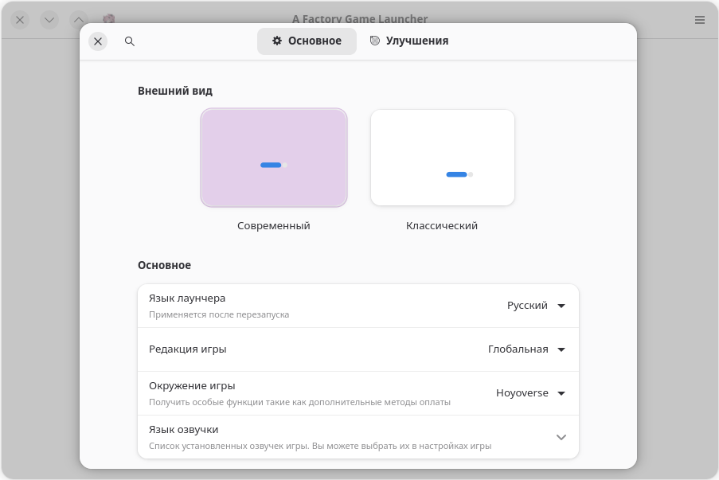
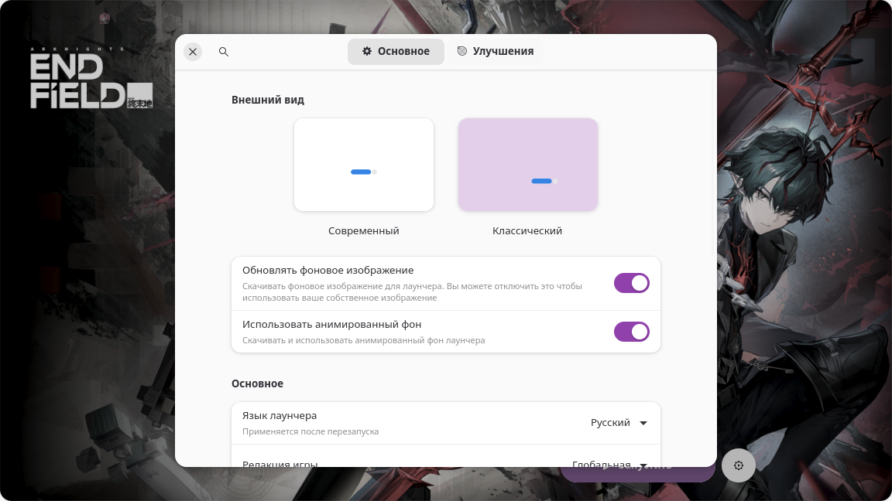

| Modern style | Classic style |
| :-: | :-: |
| <picture><source media="(prefers-color-scheme: dark)" srcset="repository/main-modern-dark.png"></picture> | <picture><source media="(prefers-color-scheme: dark)" srcset="repository/main-classic-dark.png"></picture> |
| <picture><source media="(prefers-color-scheme: dark)" srcset="repository/settings-modern-dark.png"></picture> | <picture><source media="(prefers-color-scheme: dark)" srcset="repository/settings-classic-dark.png"></picture> |

    <a href="https://discord.gg/ck37X6UWBp">Anime Team Discord</a> ·
    <a href="https://discord.gg/HzUujKkXMd">Kagebyte Discord</a> ·
    <a href="https://zulip.dawn.wine">Anime Team Zulip</a> ·
    <a href="https://github.com/an-anime-team/an-anime-game-launcher/wiki">Anime Launcher Wiki</a>

 

# This Project is a fan-made FORK of An Anime Game Launcher made by An Anime Team.   
### Please be that kind to NOT disturbing them about any bugs and/or issues  
Feel free to contact us via <a href="https://github.com/kagebyte-inc/a-factory-game-launcher/issues">Issues</a> or <a href="https://discord.gg/HzUujKkXMd">Discord</a>

# ♥️ Useful links and thanks

//TBF

# ⬇️ Download

//TBF

## 😀 Official support

//TBF

## 🙂 Community support

//TBF

## 😑 Third party support

//TBF

# 🚧 Project status

This project is in maintenance mode and is considered feature complete. It will continue to receive updates with bugfixes and support for new versions of the game. The various contributors help keep this project alive by keeping it up to date with latest game changes. I'm working on other projects, and the future is in uniting all the launchers in one single [universal launcher](https://github.com/an-anime-team/anime-games-launcher). This project stays in "proof of concept" stage right now and requires major changes, which, again, require interest from my side. Keep your eye on our discord server for more details.
